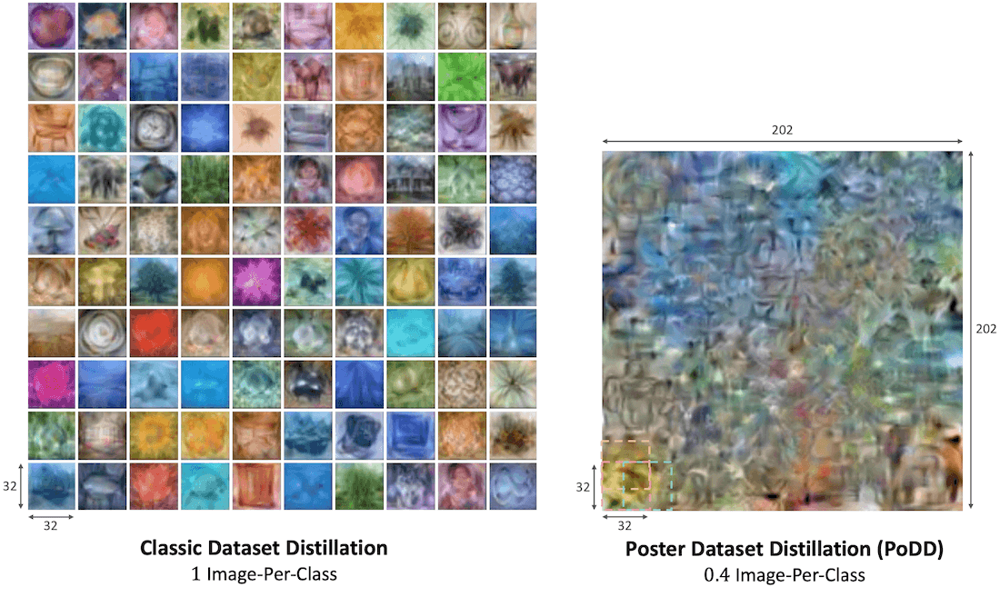

# Distilling Datasets Into Less Than One Image
Official PyTorch Implementation for the "Distilling Datasets Into Less Than One Image" paper.  

[](https://paperswithcode.com/sota/dataset-distillation-1ipc-on-cifar-10?p=distilling-datasets-into-less-than-one-image)
[](https://paperswithcode.com/sota/dataset-distillation-1ipc-on-cifar-100?p=distilling-datasets-into-less-than-one-image)
[](https://paperswithcode.com/sota/dataset-distillation-1ipc-on-cub-200-2011?p=distilling-datasets-into-less-than-one-image)
[](https://paperswithcode.com/sota/dataset-distillation-1ipc-on-tinyimagenet?p=distilling-datasets-into-less-than-one-image)

<p align="center">
    🌐 <a href="https://vision.huji.ac.il/podd/" target="_blank">Project</a> | 📃 <a href="https://arxiv.org/abs/2403.12040" target="_blank">Paper</a> <br>
</p>


<center>
    <p>
        
    </p>
    <p>
        <em><strong>Poster Dataset Distillation (PoDD):</strong> We propose PoDD, a new dataset distillation setting for a tiny, under 1 image-per-class (IPC) budget. In this example, the standard method attains an accuracy of 35.5% on CIFAR-100 with approximately 100k pixels, PoDD achieves an accuracy of 35.7% with less than half the pixels (roughly 40k)</em>
    </p> 
</center>
___

> **Distilling Datasets Into Less Than One Image**<br>
> Asaf Shul*, Eliahu Horwitz*, Yedid Hoshen<br>
> *Equal contribution<br>
> <a href="https://arxiv.org/abs/2403.12040" target="_blank">https://arxiv.org/abs/2403.12040 </a> <br>
>
>**Abstract:** Dataset distillation aims to compress a dataset into a much smaller one 
> so that a model trained on the distilled dataset achieves high accuracy. 
> Current methods frame this as maximizing the distilled classification accuracy for a
> budget of K distilled *images-per-class*, where K is a positive integer.
> In this paper, we push the boundaries of dataset distillation, 
> compressing the dataset into less than an image-per-class. 
> It is important to realize that the meaningful quantity is not the number of distilled
> *images-per-class* but the number of distilled *pixels-per-dataset*. We therefore,
> propose *Poster Dataset Distillation* (PoDD), a new approach that distills the
> entire original dataset into a single poster. The poster approach motivates new
> technical solutions for creating training images and learnable labels. 
> Our method can achieve comparable or better performance with less than an 
> image-per-class compared to existing methods that use one image-per-class. 
> Specifically, our method establishes a new state-of-the-art performance on CIFAR-10,
> CIFAR-100, and CUB200 using as little as 0.3 images-per-class. 


<center>
    <p>
        
    </p>
    <p>
        <em>Poster distillation progress over time followed by a semantic visualization of the distilled classes using a poster of CIFAR-10 with 1 IPC</em>
    </p> 
</center>

## Project Structure
This project consists of:
- [`main.py`](./main.py) - Main entry point (handles user run arguments).
- [`src/base.py`](./src/base.py) - Main worker for the distillation process.
- [`src/PoDD.py`](./src/PoDD.py) - *PoDD* implementation using *RaT-BPTT* as the underlying dataset distillation algorithm.
- [`src/PoCO.py`](./src/PoCO.py) - *PoCO* class ordering strategy implementation, using *CLIP* text embeddings.
- [`src/PoDDL.py`](./src/PoDDL.py) - *PoDDL* soft labeling strategy implementation.
- [`src/PoDD_utils.py`](./src/PoDD_utils.py) - Utility functions for *PoDD*.
- [`src/data_utils.py`](./src/data_utils.py) - Utility functions for data handling.
- [`src/util.py`](./src/util.py) - General utility functions.
- [`src/convnet.py`](./src/convnet.py) - *ConvNet* model for the distillation process.

## Installation 
1.  Clone the repo:
```bash
git clone https://github.com/AsafShul/PoDD
cd PoDD
```
2. Create a new environment with needed libraries from the `environment.yml` file, then activate it:
```bash
conda env create -f environment.yml
conda activate podd
```

## Dataset Preparation
This implementation supports the following 4 datasets:
- [CIFAR-10](https://paperswithcode.com/dataset/cifar-10)
- [CIFAR-100](https://paperswithcode.com/dataset/cifar-100)
- [CUB200](https://paperswithcode.com/dataset/cub-200-2011) 
- [Tiny ImageNet](https://paperswithcode.com/dataset/tiny-imagenet)

#### CIFAR-10 and CIFAR-100
Both the CIFAR-10 and CIFAR-100 datasets are built-in and will be downloaded automatically. 

#### CUB200
1. Download the data from [here](https://www.vision.caltech.edu/datasets/cub_200_2011/)
2. Extract the dataset into `./datasets/CUB200` 

#### Tiny ImageNet
1. Download the dataset by running `wget http://cs231n.stanford.edu/tiny-imagenet-200.zip` 
2. Extract the dataset into `./tiny-imagenet-200/tiny-imagenet-200` 
3. Preprocess the validation split of the dataset to fit torchvision's ImageFolder structure. This can be done by running the function `format_tiny_imagenet_val` located in `./src/data_utils.py`
 


## Running PoDD
The `main.py` script is the main script in this project.

Below are examples for running PoDD on [CIFAR-10](https://paperswithcode.com/dataset/cifar-10), [CIFAR100](https://paperswithcode.com/dataset/cifar-100), [CUB200](https://paperswithcode.com/dataset/cub-200-2011) 
and [Tiny ImageNet](https://paperswithcode.com/dataset/tiny-imagenet) datasets for 0.9 IPC.

#### CIFAR-10
```bash
python main.py --name=PoDD-CIFAR10-LT1-90 --distill_batch_size=96 --patch_num_x=16 --patch_num_y=6 --dataset=cifar10 --num_train_eval=8 --update_steps=1 --batch_size=5000 --ddtype=curriculum --cctype=2 --epoch=10000 --test_freq=10 --print_freq=10 --arch=convnet --window=60 --minwindow=0 --totwindow=200 --inner_optim=Adam --outer_optim=Adam --inner_lr=0.001 --lr=0.001 --syn_strategy=flip_rotate --real_strategy=flip_rotate --seed=0 --zca --comp_ipc=1 --class_area_width=32 --class_area_height=32 --poster_width=153 --poster_height=60 --poster_class_num_x=5 --poster_class_num_y=2
```

#### CIFAR-100
```bash
python main.py --name=PoDD-CIFAR100-LT1-90 --distill_batch_size=50 --patch_num_x=20 --patch_num_y=20 --dataset=cifar100 --num_train_eval=8 --update_steps=1 --batch_size=2000 --ddtype=curriculum --cctype=2 --epoch=10000 --test_freq=10 --print_freq=10 --arch=convnet --window=100 --minwindow=0 --totwindow=300 --inner_optim=Adam --outer_optim=Adam --inner_lr=0.001 --lr=0.001 --syn_strategy=flip_rotate --real_strategy=flip_rotate --seed=0 --zca --comp_ipc=1 --class_area_width=32 --class_area_height=32 --poster_width=303 --poster_height=303 --poster_class_num_x=10 --poster_class_num_y=10 --train_y
```

#### CUB200
```bash
python main.py --name=PoDD-CUB200-LT1-90 --distill_batch_size=200 --patch_num_x=60 --patch_num_y=30 --dataset=cub-200 --num_train_eval=8 --update_steps=1 --batch_size=3000 --ddtype=curriculum --cctype=2 --epoch=10000 --test_freq=25 --print_freq=10 --arch=convnet --window=60 --minwindow=0 --totwindow=200 --inner_optim=Adam --outer_optim=Adam --inner_lr=0.001 --lr=0.001 --syn_strategy=flip_rotate --real_strategy=flip_rotate --seed=1 --zca --comp_ipc=1 --class_area_width=32 --class_area_height=32 --poster_width=610 --poster_height=302 --poster_class_num_x=20 --poster_class_num_y=10 --train_y
```
#### Tiny ImageNet
```bash
python main.py --name=PoDD_TinyImageNet-LT1-90 --distill_batch_size=30 --patch_num_x=40 --patch_num_y=20 --dataset=tiny-imagenet-200 --num_train_eval=8 --update_steps=1 --batch_size=500 --ddtype=curriculum --cctype=2 --epoch=10000 --test_freq=5 --print_freq=1 --arch=convnet --window=100 --minwindow=0 --totwindow=300 --inner_optim=Adam --outer_optim=Adam --inner_lr=0.0005 --lr=0.0005 --syn_strategy=flip_rotate --real_strategy=flip_rotate --seed=0 --zca --comp_ipc=1 --class_area_width=64 --class_area_height=64 --poster_width=1211 --poster_height=608 --poster_class_num_x=20 --poster_class_num_y=10 --train_y
```

#### Important Hyper-parameters
- `--patch_num_x` and `--patch_num_y` - The number of extracted overlapping patches in the x and y axis of the poster.
- `--poster_width` and `--poster_height` - The width and height of the poster (controls the distillation data budget).
- `--poster_class_num_x` and `--poster_class_num_y` - The class layout dimensions within the poster as a 2d array (e.g., 10X10 or 20X5), 
(the product must be equal to the number of classes).
- `--train_y` - If set, the model will also optimize a set of learnable labels for the poster.

> [!TIP] 
> Increase the `distill_batch_size` and `batch_size` as your GPU memory limitations allow. 


## Using PoDD with other Dataset Distillation Algorithms
Although we use [*RaT-BPTT*](https://arxiv.org/pdf/2311.07025.pdf) as the underlying distillation algorithm, using PoDD with other dataset distillation algorithms should be straight forward. 
The main change is replacing the distillation functionality in `src/base.py` and `src/PoDD.py` with the desired distillation algorithm.


## Citation
If you find this useful for your research, please use the following.

```
@article{shul2024distilling,
  title={Distilling Datasets Into Less Than One Image},
  author={Shul, Asaf and Horwitz, Eliahu and Hoshen, Yedid},
  journal={arXiv preprint arXiv:2403.12040},
  year={2024}
}
```

## Acknowledgments
- This repo uses [*RaT-BPTT*](https://arxiv.org/pdf/2311.07025.pdf) as the underlying distillation algorithm, the implementation of RaT-BPTT is based on the [following](https://anonymous.4open.science/r/RaT-BPTT-45EE/README.md) code found in their supplementary materials.
